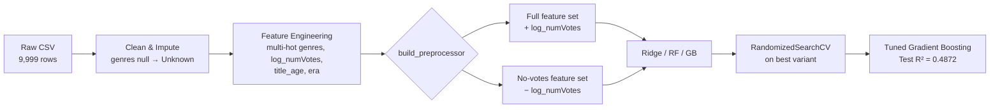

<div align="center">

# 🎬 IMDB Title Rating Prediction

**Predicting IMDB average ratings — and proving how much of that prediction is actually popularity in disguise.**


</div>

---

## TL;DR

| | |
|---|---|
| 🎯 **Task** | Regression — predict `averageRating` (1.0–9.8) |
| 📦 **Data** | 9,999 titles × 6 columns (genre, type, year, votes) |
| 🧪 **Core idea** | Train every model **with** and **without** `numVotes` to isolate content signal from popularity signal |
| 🏆 **Best model** | Tuned Gradient Boosting (full feature set) |
| 📈 **Best R²** | **0.4872** (test set, after tuning) |
| 🔍 **Key finding** | `numVotes` is the single most important feature — remove it and R² drops from 0.48 → 0.35 |

---

## Why This Project Exists

`averageRating` is shaped by two very different forces:

- **Content signal** — genre, title type, era
- **Popularity signal** — `numVotes`, which is partly self-reinforcing (popular titles get more votes, and vote volume itself correlates with rating)

`numVotes` is technically available at prediction time, but it isn't the same *kind* of signal as genre or year. So instead of just throwing it in and reporting one number, this project trains **two variants of every model** — with and without votes — to make the popularity ceiling visible rather than hiding it inside a single leaderboard score.

<details>
<summary>📂 <b>Dataset details</b> (click to expand)</summary>

<br>

**Source file:** `data/title_combined.csv`
**Shape:** 9,999 rows × 6 columns
**Target:** `averageRating` — continuous, range 1.0–9.8, mean 6.85

| Column | Description |
|---|---|
| `title` | Free text, excluded from modeling (no direct predictive value) |
| `titleType` | movie / tvSeries / videoGame / etc. |
| `genres` | Comma-separated, multi-label (28 unique genres) |
| `numVotes` | Right-skewed vote count, r ≈ 0.25 with target |
| `year` | Release year |
| `averageRating` | Target variable |

**Data quality:**
- 1 null in `genres`, filled with `'Unknown'`
- `genres` requires multi-hot encoding — a title averages 3 genres, so single-label one-hot would discard information
- `numVotes` is heavily right-skewed → log1p transform applied

</details>

---

## Pipeline



---

## Feature Engineering

| Feature | Description |
|---|---|
| `genre_<name>` (×28) | Multi-hot indicator per genre |
| `num_genres` | Count of genres a title belongs to |
| `log_numVotes` | Log1p transform of `numVotes` |
| `title_age` | Snapshot year − release year |
| `era` | Decade-style bucket (Pre-1950 → 2020s) |

A shared `build_preprocessor()` function builds the `ColumnTransformer` (scaling + one-hot) once and is reused for both variants, so the full and no-votes pipelines are identical except for the presence of `log_numVotes`.

**Split:** 80/20, `random_state` fixed via `SEED` → 7,999 train / 2,000 test rows.

---

## Results

### 🥊 Full vs. No-Votes — The Core Comparison

| Model | MAE | RMSE | R² |
|---|---|---|---|
| 🏆 **Gradient Boosting (full)** | **0.5229** | **0.7446** | **0.4776** |
| Ridge (full) | 0.5500 | 0.7719 | 0.4385 |
| Random Forest (full) | 0.5499 | 0.7870 | 0.4164 |
| Gradient Boosting (no votes) | 0.6044 | 0.8280 | 0.3540 |
| Ridge (no votes) | 0.6209 | 0.8450 | 0.3273 |
| Random Forest (no votes) | 0.6653 | 0.9048 | 0.2286 |

> Every model drops meaningfully once `numVotes` is removed — this gap **is** the finding.

### 🔧 Hyperparameter Tuning

`RandomizedSearchCV`, 40 iterations, 5-fold CV, RMSE scoring, applied to Gradient Boosting (full):

```
n_estimators     = 400
learning_rate    = 0.05
max_depth        = 4
min_samples_split = 5
subsample        = 0.9
max_features     = 'log2'
```

Best CV RMSE: **0.7438**

### ✅ Final Test Set — Tuned Gradient Boosting (Full)

| Metric | Value |
|---|---|
| MAE | 0.5128 |
| RMSE | 0.7377 |
| R² | 0.4872 |

### 🔝 Top 10 Feature Importances

| Rank | Feature | Importance |
|---|---|---|
| 1 | `log_numVotes` | 0.1903 |
| 2 | `titleType_movie` | 0.1464 |
| 3 | `titleType_tvSeries` | 0.1187 |
| 4 | `genre_Drama` | 0.0980 |
| 5 | `title_age` | 0.0605 |
| 6 | `genre_Horror` | 0.0575 |
| 7 | `year` | 0.0530 |
| 8 | `titleType_videoGame` | 0.0341 |
| 9 | `genre_Documentary` | 0.0264 |
| 10 | `genre_Animation` | 0.0243 |

---

## 🗣️ Honest Take

- **`numVotes` matters more than any single content feature.** Removing it drops R² from 0.478 to 0.354, and it's the single most important feature in the tuned model — ahead of every genre and title-type indicator combined effect. This is a popularity/exposure signal, not a content-quality signal. A model deployed to score *new, unreleased* titles wouldn't have a realistic `numVotes` value at all, so the "full" variant is best read as an **upper bound**, not a deployable pre-release predictor.
- **R² of ~0.49 even with votes reflects a genuinely hard problem.** Cast, direction, writing quality, marketing, and critical reception aren't in this dataset at all, so genre/type/year/votes were never going to fully explain rating. The two-variant design exists to make that ceiling visible, not to chase one flattering number.
- **Tuning helped, but only marginally** (test RMSE 0.7446 → 0.7377), consistent with the model already sitting close to what this feature set can support before tuning.

---

## Design Notes

- **Two-variant design is the point, not a side experiment.** Rather than including `numVotes` and calling it done, training both variants separates genuine content signal from popularity that happens to be numerically available.
- **Multi-hot over single-label genres.** Genres aren't mutually exclusive (median title has 3), so single one-hot columns would discard real information.
- **Shared `build_preprocessor()`.** Both variants get identical preprocessing except for the presence of `log_numVotes` — no silent divergence between them.
- **`title_age` + `era` over raw `year` alone.** Captures both continuous recency and non-linear shifts in rating norms across decades (e.g. IMDB rating inflation/deflation).

---

## 🗺️ Roadmap

- [ ] Text embeddings from `title` — does title semantics carry residual signal beyond genre/type?
- [ ] Votes-per-year (`numVotes / title_age`) instead of raw `log_numVotes`, to normalize for accumulation time
- [ ] Quantile regression to characterize prediction uncertainty (niche/low-vote titles are likely noisier)
- [ ] Genre *interaction* features (e.g. Horror+Comedy vs. Horror alone)

---

## Project Structure

```
imdb-rating-prediction/
├── data/
│   └── title_combined.csv
├── imdb_rating_prediction.ipynb
├── README.md
└── requirements.txt
```

## Getting Started

```bash
git clone <repo-url>
cd imdb-rating-prediction
pip install -r requirements.txt
jupyter notebook imdb_rating_prediction.ipynb
```

**Core stack:** `pandas` · `numpy` · `scikit-learn` · `matplotlib` · `seaborn`

## Test Coverage

No unit tests — this is a single end-to-end analysis/modeling notebook rather than a software package. Correctness is validated through the train/test split, 5-fold cross-validation, and residual analysis reported above.

<div align="center">

---

*Built as part of ongoing ML/AI learning work focused on methodological rigor over flattering leaderboard numbers.*

</div>